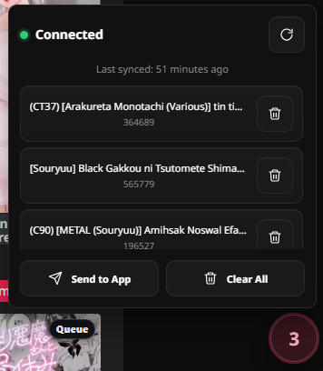
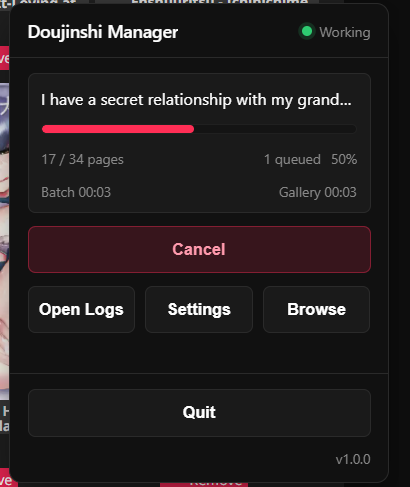
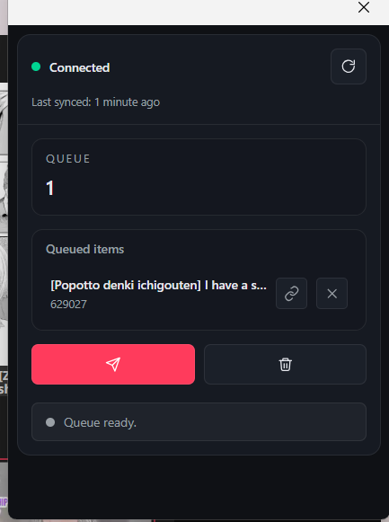
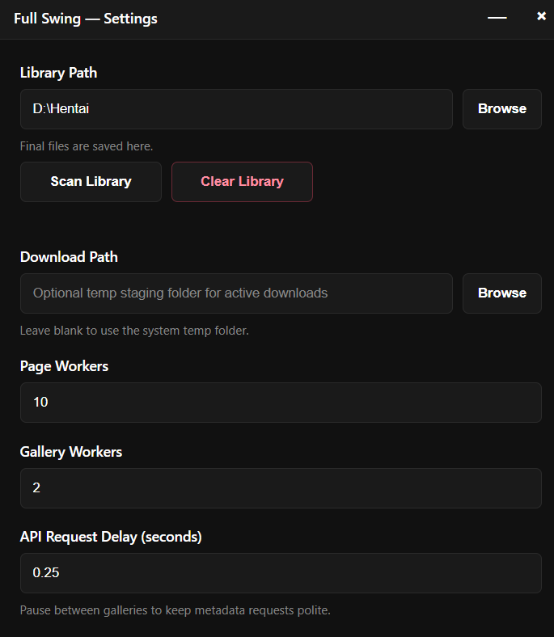

# Full Swing

This builds on [doujinshi-queue-extension](https://github.com/BrittleBullet/doujinshi-queue-extension). It works in a similar way, but adds a companion desktop app so you can download and manage everything locally. I made it for personal use, but hopefully it is useful to someone else too.

## Screenshots

| Extension | Desktop app |
| --- | --- |
|  |  |
|  |  |

## Get started

1. Download the latest zip from the GitHub Releases page.
2. Extract it to a normal folder.
3. Run the setup file, or use the portable exe.
4. Open Settings on first launch, choose your library folder, optionally set a download staging folder, and save.

## For development

```powershell
cd apps/electron
npm start
npm run package
```
